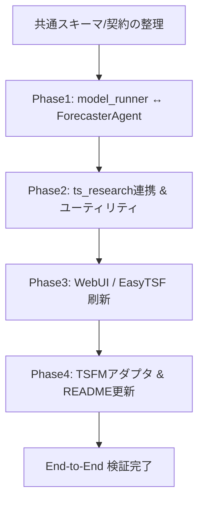

では、このリポジトリ向けの「改修計画書」を 1 本にまとめます。
そのまま `docs/` 配下に置ける Markdown を意識しています。

---

# nf_loto_platform 改修計画書

(WebUI / EasyTSF / model_runner / ts_research / TSFM 編)

## 1. 背景・目的

本リポジトリ `nf_loto_platform` は、ロト系時系列データを対象とした **統合ロト実験プラットフォーム** です。
ディレクトリ調査および pytest レポートの結果から、コアドメイン（`db/ml/agents`）はおおむね動作する一方で、以下のギャップが確認されています。

* WebUI / EasyTSF / ts_research / TSFM 連携が未接続・未実装の箇所が多数
* TSFM adapter 群が `NotImplementedError` のまま
* ts_research 用メタデータ登録ロジックの破綻（列名と ID 値の混同）
* README / docs と実装の乖離（特徴量モジュール、TSFM 統合状況など）

一方、現状の pytest は 140 テストすべてが Pass しており、
既存機能の土台は維持されていることが確認されています。

**本改修計画書の目的**は、以下の 4 テーマについて、

1. 改修スコープと優先度
2. 具体的な設計方針と実装タスク
3. テスト戦略・リスク

を整理し、チームおよび Codex にとって「実装の共通の地図」となることです。

---

## 2. 改修スコープ

対象は、次の 4 テーマです。

1. **WebUI と EasyTSF の import / 依存注入刷新**

   * `nf_loto_platform` パッケージ前提の構造に揃え、未実装部分はロードマップ化。
2. **model_runner の目的関数ログ整備 & ForecasterAgent API 整合**

   * 目的関数を meta / ログに記録し、ForecasterAgent から一貫して参照できるようにする。
3. **ts_research 連携の確立とユーティリティ補完**

   * dataset 登録・anomaly/causal 解析・Scientist Agent の E2E を通し、`AnomalyAgent.to_rows` など欠けている部品を補完。
4. **TSFM adapter の最低 1 モデル実装 & README 更新**

   * TSFM adapter を少なくとも 1 モデル（Chronos2-ZeroShot 想定）で動作させ、README/docs の記述を現実に合わせる。

---

## 3. 全体方針とフェーズ構成

改修は **「共通契約 → model_runner/Agents → ts_research → 入口/UI → TSFM」** の順で進めます。

* **Phase1:** model_runner と ForecasterAgent の契約を固め、メトリクスの標準化を行う
* **Phase2:** ts_research と dataset / metrics / anomaly / Scientist の往復を 1 本通す
* **Phase3:** WebUI / EasyTSF を `nf_loto_platform` 公開 API ベースで再接続
* **Phase4:** TSFM adapter を 1 本通しで動かし、外部向けの README/docs を同期

---

## 4. 現状課題の整理（要点）

repository_audit および pytest ログの観点から、主な課題は次の通りです。

1. **WebUI が現行パッケージ構造と不整合**

   * `apps/webui_streamlit/streamlit_app.py` が `config.db_config` や `src.*` を import しており、現構造では `ModuleNotFoundError` となる。

2. **EasyTSF runner がダミー状態**

   * `_lazy_import_orchestrator` が必須引数を持つ `AgentOrchestrator` を引数なしで生成しようとし、例外となる設計。
   * `run_easytsf` も設定を print するだけで、実質未実装。

3. **ts_research メタ登録の破綻**

   * `TSResearchOrchestrator.ensure_dataset` が `id_columns=list(unique_ids)` を渡しており、「列名」ではなく「ID 値のリスト」を永続化している。

4. **AnomalyAgent / ScientistAgent の未完成**

   * `AnomalyAgent` に `to_rows` 実装がなく、検知結果を DB 行に変換できない。
   * `TimeSeriesScientistAgent` が `BaseLLMClient.generate` 契約ではなく `complete` メソッドを呼ぼうとしている。

5. **TSFM adapter がすべて NotImplemented**

   * Chronos/TimesFM/Lag-Llama/TempoPFN などの `predict` が `NotImplementedError` のまま。
   * README/docs は「TSFM 統合済み」に近い文言で乖離がある。

6. **特徴量 / 設定系ドキュメントの乖離**

   * README で列挙されている features モジュールが実装されておらず、ImportError のリスクあり。
   * `db/db_config.py` に平文パスワードがハードコードされている。

---

## 5. テーマ別改修方針・タスク

### 5.1 テーマ1: WebUI / EasyTSF の import・依存注入刷新

#### 目的

* WebUI / EasyTSF を **`nf_loto_platform` の公開 API だけに依存する薄い入口レイヤ**にする。
* 依存（DB, ts_research, LLM, model_runner）は `apps/dependencies.py` で一元管理し、将来の差し替えを容易にする。

#### 設計方針

* `src/nf_loto_platform/apps/dependencies.py` を **依存ファクトリの単一入口**とし、以下の関数を提供済み or 提供予定：

  * `get_db_conn()`
  * `get_ts_research_client()`
  * `get_llm_client()`
  * `get_model_runner()`
* WebUI / EasyTSF は、これらのファクトリ経由で依存を取得する。

#### 実装タスク（MVP）

1. **依存ファクトリの skeleton 実装**

   * 既に追加済みの `dependencies.py` を、実際の設定読み込み（`core/settings.load_db_config` など）に接続。
2. **WebUI の import 整理**

   * `config.*` や `src.*` import を廃止し、

     * `from nf_loto_platform.apps.dependencies import get_db_conn, get_model_runner` 等に統一。
   * MVP として「単一テーブル + loto 種別 + horizon + objective を指定し、AutoNHITS で 1 実験実行」のパスを実装。
3. **EasyTSF runner の再構成**

   * `_lazy_import_orchestrator` を廃止し、`build_agent_orchestrator(db_conn, ts_research_client, llm_client, model_runner)` に変更。
   * `run_easytsf(config_path)` で config 読み込み → 依存生成 → Orchestrator 構築 → `run_full_cycle(...)` 実行までを通す（最初は ts_research / TSFM なしで可）。
4. **テスト**

   * WebUI: import だけの smoke テスト（モジュール import + 主要関数コール）を追加。
   * EasyTSF: 設定ファイルを元に `run_easytsf` を呼び、例外なく終了することを確認するテストを追加。

#### ロードマップ（後続）

* WebUI から ts_research の dataset/anomaly/Scientist 結果を参照するビューを追加。
* EasyTSF 設定に TSFM モデル指定を許可し、TSFM adapter 経由の実験も実行可能にする。

---

### 5.2 テーマ2: model_runner 目的関数ログ & ForecasterAgent API 整合

#### 目的

* `run_loto_experiment` / `sweep_loto_experiments` / `ForecasterAgent.run_sweep` 間の **objective/metric 契約を統一**し、メトリクスが meta・ログに一貫して残る状態にする。

#### 設計方針

* 外向き API（WebUI/EasyTSF/ForecasterAgent）では `objective`, `secondary_metric` を使用。
* model_runner 内部では `loss_name`, `metric_name` を使用。
* `Result.meta` には以下を標準で含める：

  * `objective_name`, `objective_value`
  * `metric_name`, `metric_value`（存在する場合）

#### 実装タスク

1. **契約ドキュメントの確認・補強**

   * `docs/contracts/model_runner_and_agents.md` をベースに、最新の実装・テストと整合するよう微調整。
2. **model_runner の meta / ログ拡張**

   * `run_loto_experiment` の戻り値 meta に `objective_name/value`, `metric_name/value` を追加。
   * `log_run_start` / `log_run_end` にも該当フィールドを渡す。
3. **sweep_loto_experiments の統一インタフェース**

   * `objective`, `metric` を引数で受け、内部で `run_loto_experiment` に渡す。
   * 戻り値リストの各要素の meta に上記フィールドが揃うようにする。
4. **ForecasterAgent の API 整合**

   * `run_sweep(objective, metric, ...)` が、そのまま `sweep_loto_experiments(objective=..., metric=...)` に渡る形に修正。
   * best trial を objective に基づいて選択し、meta 情報（model_name, objective_value など）を返す。
5. **テスト**

   * 既存の integration / nonfunctional テストに meta フィールドの検証を追加。
   * ForecasterAgent のユニットテストで、複数 trial の中から最小 loss を正しく選ぶことを確認。

---

### 5.3 テーマ3: ts_research 連携 & ユーティリティ補完

#### 目的

* ts_research まわり（dataset 登録 → experiment / metrics → anomaly/causal → Scientist Agent）を **1 本の E2E フロー**として確立する。
* `AnomalyAgent.to_rows` など欠けている部品を埋め、store 層との結合を強化する。

#### 設計方針

* canonical panel スキーマ：

  * `unique_id` / `ds` / `y` を必須カラムとする。
* ts_research API への dataset 登録：

  * `id_columns=["unique_id"]`, `time_column="ds"`, `target_column="y"` が基本形。
* `id_columns` は常に **「列名」** を表し、**ID 値のリストではない**ことを徹底。

#### 実装タスク

1. **契約ドキュメントの整備**

   * `docs/contracts/ts_research_integration.md` を基準に、dataset / experiment / metrics / anomaly / causal のスキーママッピングを確定。
2. **TSResearchOrchestrator.ensure_dataset の修正**

   * `id_columns=list(unique_ids)` となっている箇所を修正し、`id_columns=[unique_id_col]` のように列名を渡す。
   * 同時に、呼び出し側で「unique_ids（値の集合）」と「id_columns（列名）」を明確に分ける。
3. **AnomalyAgent.to_rows の実装**

   * ts_research の anomaly レコードを `List[dict]`（DB バルク insert 向け）に変換するユーティリティを実装。
   * カラム例：

     * `experiment_id, dataset_id, unique_id, ds, score, is_anomaly, extra(json)`
4. **TimeSeriesScientistAgent の LLM 抽象追従**

   * `BaseLLMClient.generate` ベースに書き直し、既存の EchoLLMClient などで動作確認。
5. **ts_research_store の補完**

   * `get_metrics_for_experiment(experiment_id: int) -> dict[str, float]` を実装し、テスト `test_ts_research_store_has_get_metrics_for_experiment` を満たす。
6. **E2E テスト**

   * ダミー panel ＋ stub ts_research store を用いて、

     1. dataset 登録
     2. model_runner によるメトリクス書き込み
     3. anomaly 検知結果の保存
     4. Scientist Agent による要約
        までを 1 本通す integration テストを追加。

---

### 5.4 テーマ4: TSFM アダプタ 1 モデル実装 & README 更新

#### 目的

* TSFM adapter 群から、少なくとも 1 モデル（Chronos2-ZeroShot 想定）を **実際に inference まで動かす**。
* TSFM 関連の README / docs を実装内容に同期させ、利用者の期待との齟齬を解消する。

#### 設計方針

* すでに `src/nf_loto_platform/tsfm/base.py` に定義した `TSFMAdapter` Protocol に準拠：

  * 入力: `unique_id, ds, y` を含む panel DataFrame
  * 出力: `unique_id, ds, yhat` を含む予測 DataFrame
* 実運用とテストを分離：

  * **実運用:** 外部 TSFM 実装（例: Chronos2）を try/except で動的 import。
  * **テスト:** 依存を要求しない naive backend（ラスト値コピーなど）で adapter の形だけ保証。

#### 実装タスク

1. **Chronos2ZeroShotAdapter の追加**

   * `src/nf_loto_platform/tsfm/chronos2_adapter.py` に adapter クラスを追加。
   * テスト環境では外部ライブラリ不要な naive 実装（最後の値を horizon ぶん繰り返すなど）とする。
2. **Planner registry との結線**

   * `"Chronos2-ZeroShot"` を選んだ場合、この adapter が使われるように registry を修正。
3. **ForecasterAgent 連携**

   * `engine_kind == "tsfm"` の場合に TSFM adapter を呼び出す分岐を追加し、meta に

     * `"family": "TSFM"`, `"engine_kind": "tsfm"`, `"model_name": "Chronos2-ZeroShot"`
       を格納。
4. **テスト**

   * `tests/tsfm/test_chronos2_adapter.py` を新設し、`predict` が期待スキーマの DataFrame を返すことを確認。
   * `tests/agents/test_agents_pipeline.py` の TSFM ケースを、stub ではなく adapter を通す形に拡張。
5. **README / docs 更新**

   * TSFM セクションを「現在サポートされるモデル: Chronos2-ZeroShot（実験的）」に修正。
   * TimesFM / Lag-Llama / TempoPFN は「planned」リストとして分離。
   * features モジュール一覧も実装と一致するように修正し、未移植モジュールは TODO として明記。

---

## 6. 進め方・体制イメージ

### 6.1 ロールと担当

| テーマ                            | 主担当ロール                   | 補助ロール    |
| ------------------------------ | ------------------------ | -------- |
| WebUI / EasyTSF                | アプリエンジニア / プラットフォームエンジニア | MLエンジニア  |
| model_runner / ForecasterAgent | MLエンジニア                  | データエンジニア |
| ts_research 連携                 | MLエンジニア / データエンジニア       | アプリエンジニア |
| TSFM adapter / README          | MLエンジニア                  | テックライター  |

### 6.2 スプリント単位の目安

* Sprint 1: Phase1 完了（契約ドキュメント + model_runner / ForecasterAgent 整合）
* Sprint 2: Phase2 完了（ts_research E2E + Anomaly/Scientist 整備）
* Sprint 3: Phase3 完了（WebUI / EasyTSF MVP 接続）
* Sprint 4: Phase4 完了（TSFM adapter + README/docs 更新）

---

## 7. リスクと対策

1. **外部ライブラリ仕様変更**

   * NeuralForecast / TSFM ライブラリの API 変更により model_runner / adapter が壊れるリスク。
   * → adapter 層で外部依存をラップし、コア側は安定したインタフェースのみに依存させる。

2. **ts_research サービス不達時の挙動**

   * ts_research 停止時に実験全体が失敗する可能性。
   * → Orchestrator にフォールバックモード（ローカルメトリクスのみ保存）を追加し、ログに明示。

3. **既存テストとの齟齬**

   * 改修による API 変更で既存 140 テストが落ちるリスク。
   * → 「テストを先に更新 → 実装を追従」の順で進め、期待仕様の差分を明文化。

---

## 8. 成果物一覧

* ドキュメント

  * `docs/contracts/model_runner_and_agents.md`
  * `docs/contracts/ts_research_integration.md`
  * 本改修計画書（例: `docs/nf_loto_platform_refactoring_plan.md`）
* コード

  * `src/nf_loto_platform/apps/dependencies.py`（依存ファクトリ）
  * WebUI: `apps/webui_streamlit/streamlit_app.py`（nf_loto_platform 経由の import に整理）
  * EasyTSF runner: `src/nf_loto_platform/pipelines/easytsf_runner.py`（依存注入 + run_full_cycle）
  * model_runner / ForecasterAgent の meta / API 拡張
  * ts_research orchestrator / store / AnomalyAgent / ScientistAgent の修正
  * TSFM adapter（Chronos2-ZeroShot）および関連テスト
* テスト

  * WebUI / EasyTSF の smoke テスト
  * model_runner / ForecasterAgent / ts_research / TSFM 用の追加ユニットテスト・integration テスト

---

この改修計画書をベースに、

* Codex には「各テーマごとの Implement プロンプト」
* チームには「どのスプリントでどこまでやるかの切り出し」

を行えば、段階的に **「nf_loto_platform を中核に据えた時系列 MLOps 基盤」** へ寄せていけると思います。

必要であれば、この計画書をそのまま置くためのファイル名・配置（例: `docs/REFORM_PLAN_nfloto_platform.md`）案も一緒に決めましょう。

---

## 9. 実装結果サマリ (2024-11)

* WebUI/EasyTSF は `apps/dependencies.py` ベースの依存解決に移行し、`tests/apps/test_streamlit_app.py` / `tests/test_ts_stack_extension.py` でスモークテスト済み。
* `model_runner` と `ForecasterAgent` が `objective`/`secondary_metric` 契約で連動し、tsfm/neuralforecast の両経路を `ExperimentOutcome` に統合。
* `TSResearchOrchestrator` + `AnomalyAgent.to_rows` + `TimeSeriesScientistAgent.generate` により、ts_research 連携のシナリオテスト (`tests/agents/test_ts_research_orchestrator.py`) を追加。
* `tsfm/chronos_adapter.py` に Chronos2 ゼロショットアダプタを実装し、ForecasterAgent が TSFM モデルを自動的に呼び出せるようになった。

