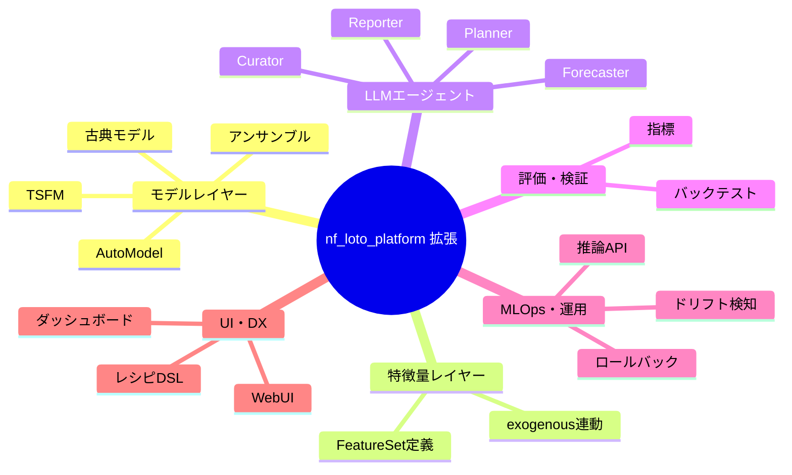

# nf_loto_platform 機能拡張 定義設計書（統合版）

## 0. ドキュメント概要

- 対象システム：`nf_loto_platform`
- 対象バージョン：TSFM 統合以降の次期メジャー拡張版
- 本書の目的：
  - TSFM 統合＋LLM エージェント＋特徴量拡張＋モデル拡張＋評価＋MLOps＋UI を包括した拡張仕様を定義する。
  - 実装チーム・設計レビュー・タスク分解の共通ベースとする。

## 1. 背景と目的

### 1.1 背景

- 現状の `nf_loto_platform` は NeuralForecast AutoModel を中心としたロト時系列実験プラットフォーム。  
- DB・メタデータ・監視・レポートの土台は存在するが、以下は限定的：  
  - TSFM / PFN 系の活用  
  - LLM エージェントによる自動化  
  - 特徴量カタログ・AutoFeatureSet 選択  
  - 本番運用（推論 API・ドリフト検知・ロールバック）  

### 1.2 目的

本機能拡張では、以下を目標とする：

1. **モデル候補レイヤーの多様化**  
   AutoModel＋TSFM＋古典モデル＋アンサンブルを統合的に扱えること。  
2. **LLM エージェントによる自動化**  
   データ診断→モデル計画→実験実行→レポート作成を LLM に委譲可能にする。  
3. **特徴量・データマート層の強化**  
   FeatureSet と exogenous サポートを紐付けて体系的に管理する。  
4. **評価・検証フレームワークの整備**  
   一般的指標＋ロト特有指標＋バックテストを標準化。  
5. **MLOps / 運用の拡張**  
   本番推論 API、ドリフト検知、再学習トリガ、ロールバックを提供。  
6. **UI / DX の改善**  
   WebUI・実験レシピ DSL・ダッシュボードによる操作性向上。  

## 2. スコープ

### 2.1 In Scope

- モデルレイヤー
  - TSFM 統合（Chronos2 / TimeGPT / TempoPFN）
  - 古典モデル（ARIMA / ETS）のアダプタ化
  - アンサンブル／メタモデル
- 特徴量／データマート
  - FeatureSet 定義と管理 API
  - AutoModelSpec.exogenous との連動
- LLM エージェント
  - Curator / Planner / Forecaster / Reporter
- 評価・検証
  - 一般指標・ロト特有指標
  - バックテスト（時系列 CV）
- MLOps／運用
  - Forecast Pipeline（推論 API）
  - ドリフト検知・再学習トリガ
  - モデルロールバック管理
- UI／DX
  - WebUI 拡張（モデル種別・FeatureSet・アンサンブル）
  - 実験レシピ DSL
  - ダッシュボード

## 3. 全体アーキテクチャ概要

## 4. 機能一覧（ID）

- モデルレイヤー  
  - F-TSFM-001〜004: TSFM 基盤＋Chronos2/TimeGPT/TempoPFN アダプタ  
  - F-MODEL-001: 古典モデルアダプタ（ARIMA/ETS）  
  - F-MODEL-002: 単純アンサンブル  
  - F-MODEL-003: メタモデル（Stacking）  
- 特徴量・データマート  
  - F-FEAT-001: FeatureSetSpec 定義と管理 API  
  - F-FEAT-002: 代表的 FeatureSet 群  
  - F-FEAT-003: Exogenous 互換性チェック  
  - F-FEAT-004: Planner による FeatureSet 自動選択  
- LLM エージェント  
  - F-AGENT-001: Curator  
  - F-AGENT-002: Planner  
  - F-AGENT-003: Forecaster  
  - F-AGENT-004: Reporter  
- 評価・検証  
  - F-EVAL-001: 一般指標統合  
  - F-EVAL-002: ロト特有指標  
  - F-EVAL-003: バックテスト API  
  - F-EVAL-004: 比較レポート生成  
- MLOps・運用  
  - F-MLOPS-001: Forecast Pipeline  
  - F-MLOPS-002: ドリフト検知  
  - F-MLOPS-003: 再学習トリガ  
  - F-MLOPS-004: ロールバック管理  
- UI・DX  
  - F-UI-001: WebUI モデル選択拡張  
  - F-UI-002: FeatureSet 選択 UI  
  - F-UI-003: 実験レシピ DSL  
  - F-UI-004: ダッシュボード  

## 5. 各機能の定義（抜粋ダイジェスト）

### 5.1 FeatureSet 周り（F-FEAT-*）

- `FeatureSetSpec`  
  - `name`, `futr_cols`, `hist_cols`, `stat_cols`, `generators` を持つ。  
- 代表的 FeatureSet：  
  - `minimal`, `calendar_basic`, `lottery_pattern`, `ts_general` など。  
- `AutoModelSpec.exogenous` との互換性チェックを行い、  
  - モデルが対応していない exogenous は無視 or 警告。  
- Planner が Curator の診断結果とモデル要件をもとに FeatureSet を自動選択。  

### 5.2 LLM エージェント（F-AGENT-*）

- Curator  
  - 標本データから統計量を計算し、LLM に「推奨 horizon / FeatureSet / 検証設定」を JSON で出力させる。  
- Planner  
  - `model_registry` と FeatureSet 情報から `params_grid` を構築。  
- Forecaster  
  - `sweep_loto_experiments` を呼び出して実験実行。  
- Reporter  
  - Forecaster の結果をもとに、LLM で自然言語レポートを生成。  

### 5.3 モデル拡張（F-MODEL-*）

- 古典モデルアダプタ  
  - Statsmodels などをラップし、TSFM と同様のインタフェースで利用可能にする。  
- アンサンブル  
  - `EnsembleSpec` に基づき、複数モデルの `y_hat` を加重平均。  
- メタモデル  
  - base model の `y_hat` を特徴量として Linear Regression 等で最終予測を学習。  

### 5.4 評価・検証（F-EVAL-*）

- 一般指標  
  - MSE / MAE / MAPE などを `ml_analysis.metrics` に集約。  
- ロト特有指標  
  - 当選数字一致数の分布など、シミュレーション的な指標。  
- バックテスト  
  - rolling-origin / expanding window をサポートする `run_loto_backtest`。  

### 5.5 MLOps（F-MLOPS-*）

- Forecast Pipeline  
  - `get_best_model(loto)` → `forecast_next(loto, n)` の API を提供。  
- ドリフト検知  
  - 直近 N 回の誤差トレンドから異常を検知。  
- ロールバック  
  - `nf_model_registry.status` と `prev_production_run_id` を使って旧モデルへ戻す。  

### 5.6 UI・DX（F-UI-*）

- WebUI に TSFM / 古典 / アンサンブルを表示し、種別ごとに選択可能に。  
- FeatureSet 選択 UI、おすすめ FeatureSet の表示。  
- `experiment_recipes.yaml` によるレシピ駆動の実験実行。  
- ダッシュボードでモデル性能・FeatureSet 利用状況・ドリフト状況を可視化。  

## 6. ロードマップ（高レベル）

- Phase 1  
  - TSFM＋古典＋FeatureSet 基盤＋単純アンサンブル。  
- Phase 2  
  - LLM エージェント（Curator/Planner/Reporter）＋バックテスト＋Forecast API。  
- Phase 3  
  - メタモデル・ダッシュボード・自己改善エージェント・非ロト時系列への汎用化。  

