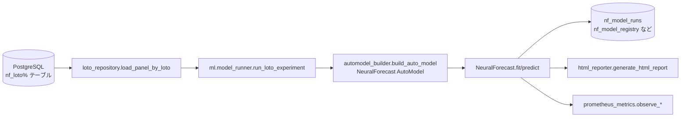

# TSFM 統合 詳細設計書（nf_loto_platform）

## 1. 改修概要

### 1.1 目的

本改修の目的は、既存の `nf_loto_platform` に対して以下を実現することです。

- NeuralForecast の AutoModel 群と同じ実験パイプラインの中で  
  **TSFM（Chronos-2 / TimeGPT / TempoPFN 等）を「1つのモデル候補」として扱えるようにする**。
- 既存の以下のレイヤーは、できる限り変更せず再利用する。
  - ロトデータ取得 (`db.loto_repository`)
  - 特徴量生成 (`features.add_lag_feature` 他)
  - 実験ランナー (`ml.model_runner.run_loto_experiment` / `sweep_loto_experiments`)
  - メタデータ保存 (`db_metadata`, `logging_ext.db_logger`)
  - 監視 (`monitoring.prometheus_metrics`)
  - HTML レポート (`reports.html_reporter`)

### 1.2 スコープ

**今回の改修範囲**

- TSFM 統合用の新規モジュール追加  
  - `src/nf_loto_platform/ml/tsfm_adapters.py`
- 既存 ML 層の拡張  
  - `src/nf_loto_platform/ml/model_registry.py`
  - `src/nf_loto_platform/ml/model_runner.py`
- （必要に応じて）設定・メタデータ拡張  
  - `config/webui_models.yaml`
  - `src/nf_loto_platform/db_metadata/schema_definitions.py`
  - `src/nf_loto_platform/logging_ext/db_logger.py`
- TSFM 用テストの追加  
  - `tests/ml/test_tsfm_adapters_contract.py`（新規）
  - `tests/ml/test_model_registry_tsfm_entries.py`（新規）
  - `tests/ml/test_model_runner_tsfm_path.py`（新規）

**対象外（別フェーズ）**

- `legacy/` 以下のレガシー Web UI / runner の TSFM 対応
- LLM エージェント（TimeSeriesScientist 型）による自動化ワークフロー本体
- MLOps 周り（MLflow, WandB 等）との TSFM 連携


## 2. 現行構成の整理

### 2.1 モジュール構成（抜粋）

| レイヤー | モジュール | 役割 |
|---------|-----------|------|
| DB      | `src/nf_loto_platform/db/loto_repository.py` | `nf_loto%` テーブルから `unique_id, ds, y, hist_*, futr_*, stat_*` を読み出す |
| 特徴量  | `src/nf_loto_platform/features/__init__.py` | `add_lag_feature` などの特徴量生成 |
| ML      | `src/nf_loto_platform/ml/automodel_builder.py` | NeuralForecast AutoModel の組み立て (`build_auto_model`, `build_neuralforecast`) |
| ML      | `src/nf_loto_platform/ml/model_registry.py` | AutoModel 一覧と外生変数サポート情報を管理 |
| ML      | `src/nf_loto_platform/ml/model_runner.py` | `run_loto_experiment` / `sweep_loto_experiments` によるロト実験実行 |
| メタ    | `src/nf_loto_platform/db_metadata/schema_definitions.py` | `nf_model_runs`, `nf_model_registry` 等のメタテーブル DDL |
| 監視    | `src/nf_loto_platform/monitoring/prometheus_metrics.py` | 実験単位のメトリクス送信 |
| レポート | `src/nf_loto_platform/reports/html_reporter.py` | 実験結果 HTML レポート生成 |

### 2.2 既存の実験フロー（NeuralForecast のみ）



`run_loto_experiment` は大まかに以下の処理を行う：

1. 実行環境情報（OS, Python バージョン, リソース）の取得  
2. DB からロトデータ（panel DataFrame）を取得  
3. `automodel_builder.split_exog_columns()` で外生変数列を振り分け  
4. `automodel_builder.build_auto_model()` で指定 AutoModel を構築  
5. `automodel_builder.build_neuralforecast()` で `NeuralForecast` を生成  
6. `NeuralForecast.fit()` → `predict()` で予測  
7. 予測結果とメタ情報 (`LotoExperimentResult`) を返却  
8. メタ情報は `logging_ext.db_logger` および Prometheus に送信  

`LotoExperimentResult` は次の dataclass で定義される：

```python
@dataclass
class LotoExperimentResult:
    run_id: int
    preds: pd.DataFrame
    meta: Dict[str, Any]
```


## 3. TSFM 統合の基本方針

### 3.1 全体方針

1. **既存 AutoModel の処理フローは変えない。**  
   `build_auto_model` / `build_neuralforecast` / `NeuralForecast.fit/predict` はそのまま利用する。

2. TSFM は **「NeuralForecast に依存しない別系統のモデル」** として扱うが、
   - `panel_df` の形式（`unique_id, ds, y, hist_*, futr_*, stat_*`）は共有
   - 返却形式は `preds: pd.DataFrame`（必須列: `unique_id, ds, y_hat`）に統一

3. `model_registry.AutoModelSpec` を拡張して、
   - `engine_kind`： `"neuralforecast"` / `"tsfm"` / `"classical"` / `"ensemble"` / `"meta"`
   - `engine_name`： `"chronos2"` / `"timegpt"` / `"tempopfn"` / `"arima"` / `"ets"` など  
   を持たせる。

4. `model_runner.run_loto_experiment` の中で  
   `spec.engine_kind` を見て **NeuralForecast 経路 / TSFM 経路 / 古典モデル経路 / アンサンブル経路** を分岐。

5. メタデータ（`nf_model_runs`, `nf_model_registry`）には、  
   `engine_kind`, `engine_name`, `feature_set` を記録し、分析で TSFM vs 従来モデルの比較がしやすいようにする。


## 4. モジュール別 詳細設計（ダイジェスト）

### 4.1 `ml/tsfm_adapters.py`（新規）

- `TSFMConfig`  
  - `model_name`, `horizon`, `freq`, `quantiles`, `context_length` などの設定を保持。  
- `BaseTSFMAdapter`  
  - `fit(panel_df) -> self`, `predict() -> preds_df` の抽象メソッドを持つ。  
  - `panel_df` は `unique_id, ds, y, ...` 形式。  
- `Chronos2Adapter` / `TimeGPTAdapter` / `TempoPFNAdapter`  
  - 各ライブラリに合わせたラッパー実装。  
  - 返却 DataFrame に `unique_id, ds, y_hat, model_name, engine_name` を必ず含める。  

### 4.2 `ml/model_registry.py` の拡張

- `AutoModelSpec` に以下を追加：  
  - `engine_kind: str = "neuralforecast"`  
  - `engine_name: Optional[str] = None`  
  - `is_zero_shot: bool = False`  
- TSFM 用エントリ例：  
  - `Chronos2-ZeroShot`  
  - `TimeGPT-ZeroShot`  
  - `TempoPFN-ZeroShot`  

### 4.3 `ml/model_runner.py` の改修

- 追加 import：  
  - `get_model_spec`, `TSFMConfig`, 各 Adapter。  
- `_build_tsfm_adapter` で `engine_name` に応じた Adapter を生成。  
- `run_loto_experiment` の中で `spec.engine_kind` により分岐：  
  - `"neuralforecast"`: 既存 AutoModel 経路。  
  - `"tsfm"`: TSFM Adapter 経路。  
  - `"classical"`: 古典モデル Adapter 経路（将来拡張）。  
  - `"ensemble"`: アンサンブル経路（将来拡張）。  

### 4.4 メタデータ・ログ

- `nf_model_runs`, `nf_model_registry` にカラム追加：  
  - `engine_kind TEXT NOT NULL DEFAULT 'neuralforecast'`  
  - `engine_name TEXT`  
  - `feature_set TEXT`  
- `logging_ext.db_logger` で上記メタ情報を書き込む。  

### 4.5 テスト

- `tests/ml/test_tsfm_adapters_contract.py`  
  - 各 Adapter が `unique_id, ds, y_hat` 列を返すことをモックで確認。  
- `tests/ml/test_model_registry_tsfm_entries.py`  
  - TSFM エントリの `engine_kind`, `engine_name` が期待通りであること。  
- `tests/ml/test_model_runner_tsfm_path.py`  
  - `engine_kind="tsfm"` 時に TSFM 経路が選択されること。  


## 5. 導入手順（概要）

1. `tsfm_adapters.py` 実装＋単体テスト。  
2. `model_registry` 拡張＋TSFM エントリ追加。  
3. `model_runner` の TSFM 経路実装。  
4. メタデータ DDL とロガーの拡張。  
5. 実データで TSFM モデルを実行し、予測が取得できることを確認。  

