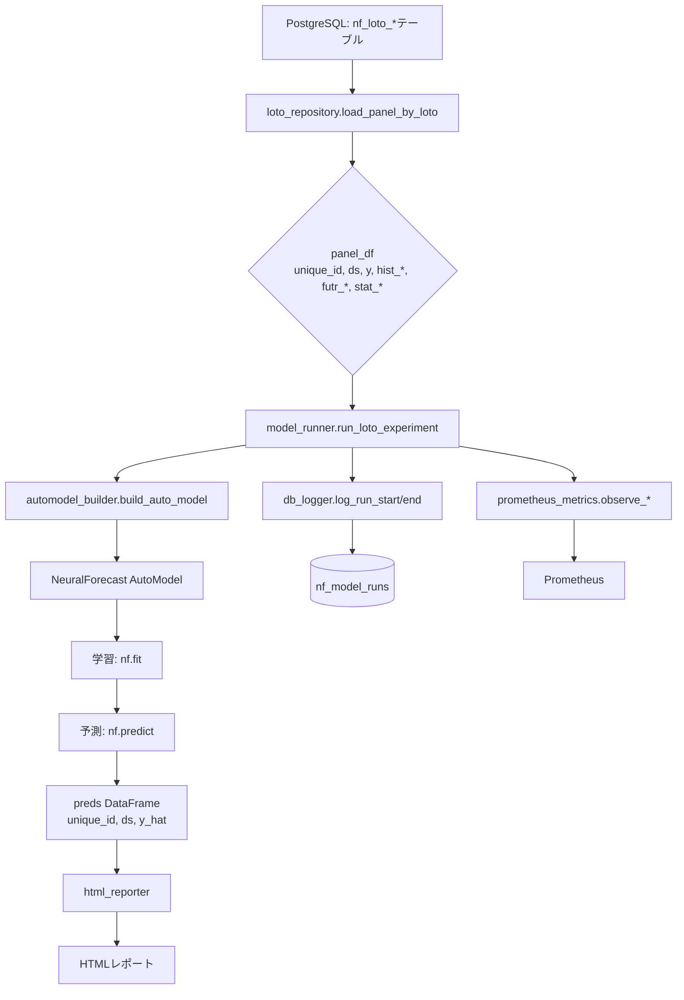
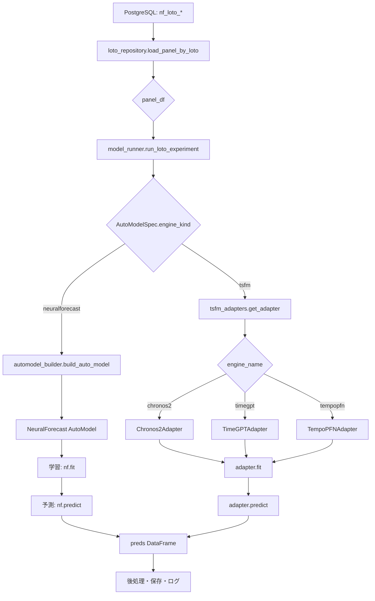

# nf_loto_platform TSFM統合 詳細機能設計定義拡張計画書

**バージョン**: 1.0  
**作成日**: 2025-11-17  
**対象システム**: nf_loto_platform v0.1.0  
**目的**: Chronos-2 / TimeGPT / TempoPFN を既存NeuralForecastパイプラインに統合

---

## エグゼクティブサマリー

本計画書は、`nf_loto_platform`に時系列基盤モデル（TSFM: Time Series Foundation Models）を統合するための詳細な実装仕様を定義します。既存のNeuralForecast AutoModelアーキテクチャとの完全な互換性を保ちながら、Chronos-2、TimeGPT、TempoPFNを「モデル候補の一つ」として選択可能にします。

### 主要な設計原則

1. **既存システムとの互換性**: DB、特徴量、メタデータ、監視システムを最大限再利用
2. **段階的統合**: 最小限の変更で動作を確認しながら段階的に機能を追加
3. **拡張性**: 将来的なTSFM追加やLLMエージェント統合を見据えた設計
4. **テスト駆動**: 各段階で包括的なテストを実施し、品質を担保

---

## 目次

1. [現行システム詳細分析](#1-現行システム詳細分析)
2. [TSFM統合アーキテクチャ](#2-tsfm統合アーキテクチャ)
3. [実装詳細仕様](#3-実装詳細仕様)
4. [段階的実装ロードマップ](#4-段階的実装ロードマップ)
5. [テスト戦略](#5-テスト戦略)
6. [運用・監視の拡張](#6-運用監視の拡張)
7. [依存関係管理](#7-依存関係管理)
8. [リスク分析と対策](#8-リスク分析と対策)
9. [将来拡張計画](#9-将来拡張計画)

---

## 1. 現行システム詳細分析

### 1.1 プロジェクト構造の詳細

```
nf_loto_platform/
├── src/nf_loto_platform/
│   ├── core/                    # コア設定・例外
│   │   ├── settings.py          # BASE_DIR, load_db_config()
│   │   └── exceptions.py        # ConfigError, DataError, RunError
│   ├── db/                      # データベースレイヤー
│   │   ├── db_config.py         # DB接続設定
│   │   ├── loto_repository.py   # パネルデータ取得
│   │   ├── postgres_manager.py  # PostgreSQL管理
│   │   └── loto_etl.py          # ETLパイプライン
│   ├── ml/                      # 機械学習レイヤー（⭐変更対象）
│   │   ├── model_registry.py    # AutoModelSpec定義
│   │   ├── model_runner.py      # run_loto_experiment実装
│   │   └── automodel_builder.py # AutoModelインスタンス化
│   ├── features/                # 特徴量生成
│   │   ├── futr_features.py     # 未来既知特徴
│   │   ├── hist_features.py     # 履歴特徴
│   │   └── stat_features.py     # 静的統計特徴
│   ├── logging_ext/             # ロギング拡張（⭐変更対象）
│   │   ├── db_logger.py         # nf_model_runsへの書き込み
│   │   ├── mlflow_logger.py     # MLflow連携
│   │   └── wandb_logger.py      # W&B連携
│   ├── monitoring/              # 監視システム
│   │   ├── prometheus_metrics.py # Prometheusメトリクス
│   │   └── resource_monitor.py  # リソース監視
│   ├── db_metadata/             # メタデータ定義（⭐変更対象）
│   │   └── schema_definitions.py # DDL定義
│   ├── reports/                 # レポート生成
│   │   └── html_reporter.py     # HTMLレポート
│   └── pipelines/               # パイプライン統合
│       └── training_pipeline.py # 実験実行パイプライン
├── config/                      # 設定ファイル（⭐変更対象）
│   ├── webui_models.yaml        # モデル定義
│   ├── features.yaml            # 特徴量設定
│   └── db.yaml.template         # DB接続設定
├── tests/                       # テストスイート
│   ├── integration/             # 統合テスト
│   ├── ml/                      # MLレイヤーテスト
│   └── nonfunctional/           # 非機能テスト
└── pyproject.toml              # プロジェクト設定
```

### 1.2 既存データフロー分析



### 1.3 既存コンポーネントの責務

#### 1.3.1 model_registry.py

**現状の実装**:
```python
@dataclass(frozen=True)
class ExogenousSupport:
    futr: bool  # 未来既知変数サポート
    hist: bool  # 履歴変数サポート
    stat: bool  # 静的変数サポート

@dataclass(frozen=True)
class AutoModelSpec:
    name: str                # "AutoTFT" など
    family: str              # "Transformer" / "MLP" / "RNN"
    univariate: bool         # 単変量予測対応
    multivariate: bool       # 多変量予測対応
    forecast_type: str       # "direct" / "recursive" / "both"
    exogenous: ExogenousSupport
```

**現在のレジストリ**:
- AutoTFT, AutoNHITS, AutoNBEATS, AutoMLP, AutoLSTM, AutoRNN
- AutoPatchTST, AutoMLPMultivariate, AutoTimeMixer
- 合計9モデル

#### 1.3.2 model_runner.py

**主要関数**: `run_loto_experiment()`

**処理フロー**:
1. Prometheusメトリクスサーバ初期化
2. リソーススナップショット取得
3. `log_run_start()` でrun_id取得
4. `load_panel_by_loto()` でデータ取得
5. `build_auto_model()` でモデル構築
6. `build_neuralforecast()` でNeuralForecastラッパー構築
7. `nf.fit()` で学習
8. `nf.predict()` で予測
9. モデル保存（`artifacts/run_{run_id}/`）
10. `log_run_end()` でメタデータ更新
11. Prometheusメトリクス送信

**重要な仕様**:
- すべての処理は `try-except` でラップされ、エラー時は `log_run_error()` を呼び出す
- リソーススナップショットは学習前後で取得
- `meta` 辞書に実験パラメータをすべて格納

#### 1.3.3 automodel_builder.py

**主要関数**:
- `build_auto_model()`: AutoModelインスタンス化
- `build_neuralforecast()`: NeuralForecastラッパー構築
- `split_exog_columns()`: hist_/futr_/stat_接頭辞で列を分類

**損失関数マッピング**:
```python
LOSS_NAME_MAP = {
    "mae": MAE,
    "mse": MSE,
    "smape": SMAPE,
}
```

#### 1.3.4 db_logger.py

**主要関数**:
- `log_run_start()`: nf_model_runsにレコード挿入、run_id返却
- `log_run_end()`: statusを"finished"に更新、メトリクス記録
- `log_run_error()`: statusを"failed"に更新、トレースバック記録

**nf_model_runsのスキーマ（推定）**:
```sql
CREATE TABLE nf_model_runs (
    id SERIAL PRIMARY KEY,
    table_name TEXT NOT NULL,
    loto TEXT NOT NULL,
    unique_ids TEXT[] NOT NULL,
    model_name TEXT NOT NULL,
    backend TEXT NOT NULL,
    horizon INTEGER NOT NULL,
    loss TEXT NOT NULL,
    metric TEXT NOT NULL,
    optimization_config JSONB,
    search_space JSONB,
    status TEXT NOT NULL DEFAULT 'running',
    start_time TIMESTAMPTZ NOT NULL DEFAULT NOW(),
    end_time TIMESTAMPTZ,
    duration_seconds DOUBLE PRECISION,
    metrics JSONB,
    best_params JSONB,
    model_properties JSONB,
    resource_summary JSONB,
    system_info JSONB,
    error_message TEXT,
    traceback TEXT,
    logs TEXT
);
```

### 1.4 既存システムの制約と前提条件

#### 制約事項
1. **AutoModelのみサポート**: 現状、NeuralForecast以外のモデルは使用不可
2. **同期処理**: 1つの実験は完全に順次実行される
3. **ローカルストレージ**: モデルは `artifacts/` 以下にローカル保存
4. **PostgreSQL必須**: メタデータはすべてPostgreSQLに依存

#### 前提条件
1. Python 3.11+
2. PostgreSQL データベースが稼働中
3. `nf_loto_*` テーブルが存在
4. GPU（オプション）: CUDA対応環境

---

## 2. TSFM統合アーキテクチャ

### 2.1 統合後のデータフロー



### 2.2 レイヤー別責務

#### レイヤー1: データ取得（変更なし）
- `loto_repository.load_panel_by_loto()`
- パネルデータを返す（unique_id, ds, y, 特徴量）

#### レイヤー2: モデル選択・構築（⭐新規追加）
- `model_registry.py`: AutoModelSpec拡張
- `tsfm_adapters.py`: TSFMアダプタ実装（新規）

#### レイヤー3: 実行制御（⭐変更）
- `model_runner.py`: engine_kind分岐追加
- NeuralForecast経路 vs TSFM経路の切り替え

#### レイヤー4: メタデータ・監視（⭐拡張）
- `db_logger.py`: engine_kind/engine_name記録
- `prometheus_metrics.py`: TSFMメトリクス追加（オプション）

### 2.3 モデル候補の統一的な扱い

WebUI等から見ると、以下のようにモデルを選択できるようになります：

```yaml
# config/webui_models.yaml（拡張後）
supported_models:
  # 既存のNeuralForecast AutoModels
  - AutoTFT
  - AutoNHITS
  - AutoMLPMultivariate
  
  # 新規追加のTSFMs
  - Chronos2-ZeroShot
  - TimeGPT-ZeroShot
  - TempoPFN-ZeroShot
```

ユーザーは「AutoTFT」を選ぶのと同じ感覚で「Chronos2-ZeroShot」を選べます。

---

## 3. 実装詳細仕様

### 3.1 Phase 1: model_registry.py の拡張

#### 3.1.1 AutoModelSpec拡張

**変更内容**:
```python
@dataclass(frozen=True)
class AutoModelSpec:
    name: str
    family: str
    univariate: bool
    multivariate: bool
    forecast_type: str
    exogenous: ExogenousSupport
    
    # ⭐新規フィールド
    engine_kind: str = "neuralforecast"  # "neuralforecast" | "tsfm"
    engine_name: str | None = None       # "chronos2" | "timegpt" | "tempopfn"
    is_zero_shot: bool = False           # ゼロショットモデルか
    requires_api_key: bool = False       # API キーが必要か
    context_length: int | None = None    # コンテキスト長（TSFM用）
```

**設計上の考慮点**:
- デフォルト値により既存コードとの互換性を保つ
- `engine_kind="neuralforecast"` がデフォルト → 既存モデルは変更不要
- `frozen=True` により immutable を維持

#### 3.1.2 TSFMレジストリエントリ

**Chronos2の定義例**:
```python
"Chronos2-ZeroShot": AutoModelSpec(
    name="Chronos2-ZeroShot",
    family="TSFM",
    univariate=True,
    multivariate=True,
    forecast_type="direct",
    exogenous=ExogenousSupport(
        futr=False,  # Chronos2は外生変数サポートなし（基本版）
        hist=True,   # 履歴データは使用
        stat=False
    ),
    engine_kind="tsfm",
    engine_name="chronos2",
    is_zero_shot=True,
    requires_api_key=False,
    context_length=512,  # Chronos2のデフォルト
),
```

**TimeGPTの定義例**:
```python
"TimeGPT-ZeroShot": AutoModelSpec(
    name="TimeGPT-ZeroShot",
    family="TSFM",
    univariate=True,
    multivariate=True,
    forecast_type="direct",
    exogenous=ExogenousSupport(
        futr=True,   # TimeGPTは外生変数サポート
        hist=True,
        stat=False
    ),
    engine_kind="tsfm",
    engine_name="timegpt",
    is_zero_shot=True,
    requires_api_key=True,  # ⭐API キー必須
    context_length=None,    # API側で管理
),
```

**TempoPFNの定義例**:
```python
"TempoPFN-ZeroShot": AutoModelSpec(
    name="TempoPFN-ZeroShot",
    family="TSFM",
    univariate=True,
    multivariate=True,
    forecast_type="direct",
    exogenous=ExogenousSupport(
        futr=False,
        hist=True,
        stat=False
    ),
    engine_kind="tsfm",
    engine_name="tempopfn",
    is_zero_shot=True,
    requires_api_key=False,
    context_length=256,  # TempoPFNのデフォルト
),
```

#### 3.1.3 バリデーション機能追加

```python
def validate_model_spec(spec: AutoModelSpec) -> None:
    """AutoModelSpecの整合性を検証する。
    
    Raises:
        ValueError: 不正な組み合わせの場合
    """
    if spec.engine_kind == "tsfm":
        if spec.engine_name is None:
            raise ValueError(f"TSFM model {spec.name} must specify engine_name")
        
        if spec.engine_name not in {"chronos2", "timegpt", "tempopfn"}:
            raise ValueError(f"Unknown TSFM engine: {spec.engine_name}")
        
        if spec.requires_api_key and spec.engine_name not in {"timegpt"}:
            raise ValueError(f"API key required but not applicable for {spec.engine_name}")
```

### 3.2 Phase 2: tsfm_adapters.py の実装

#### 3.2.1 共通インタフェース

**ファイルパス**: `src/nf_loto_platform/ml/tsfm_adapters.py`

```python
"""TSFM（Time Series Foundation Models）アダプタモジュール.

各TSFMを共通インタフェースでラップし、NeuralForecastと同じように扱えるようにする。
"""

from __future__ import annotations

import os
from abc import ABC, abstractmethod
from dataclasses import dataclass
from typing import Any, Dict, List, Optional

import pandas as pd
import numpy as np


@dataclass
class TSFMConfig:
    """TSFM共通設定."""
    model_name: str          # Hugging Face model ID or service name
    horizon: int             # 予測ホライズン
    freq: str                # "D", "W", "H" など
    quantiles: Optional[List[float]] = None  # 分位点予測（オプション）
    context_length: Optional[int] = None     # コンテキスト長
    api_key: Optional[str] = None            # API キー（TimeGPT等）
    device: str = "cpu"                      # "cpu" | "cuda"


class BaseTSFMAdapter(ABC):
    """TSFMモデルの抽象基底クラス."""

    def __init__(self, config: TSFMConfig) -> None:
        self.config = config
        self._is_fitted = False
        self._train_panel: Optional[pd.DataFrame] = None

    @abstractmethod
    def fit(self, panel_df: pd.DataFrame) -> "BaseTSFMAdapter":
        """モデルの準備（ゼロショットの場合はデータ保存のみ）.
        
        Args:
            panel_df: unique_id, ds, y を含むパネルデータ
        
        Returns:
            self
        """
        pass

    @abstractmethod
    def predict(self) -> pd.DataFrame:
        """予測を実行.
        
        Returns:
            unique_id, ds, y_hat を含むDataFrame
        """
        pass

    def _validate_panel(self, df: pd.DataFrame) -> None:
        """パネルデータの妥当性を検証."""
        required_cols = {"unique_id", "ds", "y"}
        if not required_cols.issubset(df.columns):
            raise ValueError(f"Panel must contain {required_cols}, got {df.columns.tolist()}")
        
        if df["y"].isna().all():
            raise ValueError("All y values are NaN")

    def save(self, path: str) -> None:
        """モデル保存（TSFM はゼロショットなので設定のみ保存）."""
        import json
        os.makedirs(path, exist_ok=True)
        config_dict = {
            "model_name": self.config.model_name,
            "horizon": self.config.horizon,
            "freq": self.config.freq,
            "context_length": self.config.context_length,
        }
        with open(os.path.join(path, "tsfm_config.json"), "w") as f:
            json.dump(config_dict, f, indent=2)
```

#### 3.2.2 Chronos2Adapter実装

```python
class Chronos2Adapter(BaseTSFMAdapter):
    """Chronos-2 TSFM アダプタ.
    
    Hugging Face の amazon/chronos-2 モデルを使用。
    ゼロショット予測のため学習は不要。
    """

    def __init__(self, config: TSFMConfig) -> None:
        super().__init__(config)
        self._pipeline = None

    def fit(self, panel_df: pd.DataFrame) -> "Chronos2Adapter":
        """データを保持（学習は不要）."""
        self._validate_panel(panel_df)
        self._train_panel = panel_df.copy()
        self._is_fitted = True
        
        # 遅延ロード: 実際に使うときだけimport
        self._load_pipeline()
        return self

    def _load_pipeline(self) -> None:
        """Chronos パイプラインをロード."""
        if self._pipeline is not None:
            return
        
        try:
            from chronos import ChronosPipeline
        except ImportError as e:
            raise ImportError(
                "Chronos library is not installed. "
                "Install with: pip install chronos-forecasting"
            ) from e
        
        # モデルロード
        self._pipeline = ChronosPipeline.from_pretrained(
            self.config.model_name,
            device_map=self.config.device,
            torch_dtype="auto",
        )

    def predict(self) -> pd.DataFrame:
        """ゼロショット予測を実行."""
        if not self._is_fitted:
            raise RuntimeError("Must call fit() before predict()")
        
        df = self._train_panel
        preds_list = []
        
        # unique_id ごとに予測
        for uid, group in df.groupby("unique_id"):
            series = group.sort_values("ds")["y"].to_numpy()
            
            # NaN除外
            valid_mask = ~np.isnan(series)
            series_clean = series[valid_mask]
            
            if len(series_clean) == 0:
                continue
            
            # コンテキスト長で切り詰め
            if self.config.context_length and len(series_clean) > self.config.context_length:
                series_clean = series_clean[-self.config.context_length:]
            
            # 予測実行
            context = torch.tensor(series_clean).unsqueeze(0)
            forecast = self._pipeline.predict(
                context=context,
                prediction_length=self.config.horizon,
                num_samples=20,  # サンプル数
            )
            
            # 中央値を取得
            y_hat = forecast[0].median(dim=0).values.cpu().numpy()
            
            # 未来の日付を生成
            last_ds = group["ds"].max()
            future_dates = pd.date_range(
                start=last_ds + pd.Timedelta(1, unit=self.config.freq[0]),
                periods=self.config.horizon,
                freq=self.config.freq,
            )
            
            pred_df = pd.DataFrame({
                "unique_id": uid,
                "ds": future_dates,
                "y_hat": y_hat,
            })
            preds_list.append(pred_df)
        
        return pd.concat(preds_list, ignore_index=True) if preds_list else pd.DataFrame()
```

#### 3.2.3 TimeGPTAdapter実装

```python
class TimeGPTAdapter(BaseTSFMAdapter):
    """TimeGPT API アダプタ.
    
    Nixtla の TimeGPT サービスを使用。
    API キーが必要。
    """

    def __init__(self, config: TSFMConfig) -> None:
        super().__init__(config)
        self._client = None

    def fit(self, panel_df: pd.DataFrame) -> "TimeGPTAdapter":
        """データを保持しAPIクライアント初期化."""
        self._validate_panel(panel_df)
        self._train_panel = panel_df.copy()
        self._is_fitted = True
        
        # APIクライアント初期化
        self._initialize_client()
        return self

    def _initialize_client(self) -> None:
        """TimeGPT クライアントを初期化."""
        if self._client is not None:
            return
        
        try:
            from nixtla import NixtlaClient
        except ImportError as e:
            raise ImportError(
                "Nixtla SDK is not installed. "
                "Install with: pip install nixtla"
            ) from e
        
        # API キー取得（設定 > 環境変数の順）
        api_key = self.config.api_key or os.environ.get("TIMEGPT_API_KEY")
        if not api_key:
            raise ValueError(
                "TimeGPT requires API key. "
                "Set TIMEGPT_API_KEY environment variable or pass api_key in config."
            )
        
        self._client = NixtlaClient(api_key=api_key)
        
        # API接続確認
        try:
            self._client.validate_api_key()
        except Exception as e:
            raise RuntimeError(f"TimeGPT API key validation failed: {e}") from e

    def predict(self) -> pd.DataFrame:
        """TimeGPT API で予測."""
        if not self._is_fitted:
            raise RuntimeError("Must call fit() before predict()")
        
        df = self._train_panel
        
        # TimeGPT APIは全系列を一度に処理できる
        result = self._client.forecast(
            df=df,
            h=self.config.horizon,
            freq=self.config.freq,
            time_col="ds",
            target_col="y",
            id_col="unique_id",
        )
        
        # カラム名を統一
        result = result.rename(columns={"TimeGPT": "y_hat"})
        
        # 必要なカラムのみ抽出
        return result[["unique_id", "ds", "y_hat"]].copy()
```

#### 3.2.4 TempoPFNAdapter実装

```python
class TempoPFNAdapter(BaseTSFMAdapter):
    """TempoPFN アダプタ.
    
    Prior-Data Fitted Networks (PFN) ベースのTSFM。
    事前学習済みモデルをロードして使用。
    """

    def __init__(self, config: TSFMConfig) -> None:
        super().__init__(config)
        self._model = None

    def fit(self, panel_df: pd.DataFrame) -> "TempoPFNAdapter":
        """データを保持しモデルをロード."""
        self._validate_panel(panel_df)
        self._train_panel = panel_df.copy()
        self._is_fitted = True
        
        # モデルロード
        self._load_model()
        return self

    def _load_model(self) -> None:
        """TempoPFN モデルをロード."""
        if self._model is not None:
            return
        
        try:
            from tempopfn import TempoPFN
        except ImportError as e:
            raise ImportError(
                "TempoPFN library is not installed. "
                "Install from: https://github.com/automl/TempoPFN"
            ) from e
        
        # 事前学習済みモデルロード
        self._model = TempoPFN.from_pretrained(
            self.config.model_name,
            device=self.config.device,
        )

    def predict(self) -> pd.DataFrame:
        """PFN 推論で予測."""
        if not self._is_fitted:
            raise RuntimeError("Must call fit() before predict()")
        
        df = self._train_panel
        preds_list = []
        
        # unique_id ごとに予測
        for uid, group in df.groupby("unique_id"):
            series = group.sort_values("ds")["y"].to_numpy()
            
            # NaN除外
            valid_mask = ~np.isnan(series)
            series_clean = series[valid_mask]
            
            if len(series_clean) == 0:
                continue
            
            # コンテキスト長で切り詰め
            if self.config.context_length and len(series_clean) > self.config.context_length:
                series_clean = series_clean[-self.config.context_length:]
            
            # PFN 推論
            y_hat = self._model.predict(
                series_clean,
                horizon=self.config.horizon,
            )
            
            # 未来の日付を生成
            last_ds = group["ds"].max()
            future_dates = pd.date_range(
                start=last_ds + pd.Timedelta(1, unit=self.config.freq[0]),
                periods=self.config.horizon,
                freq=self.config.freq,
            )
            
            pred_df = pd.DataFrame({
                "unique_id": uid,
                "ds": future_dates,
                "y_hat": y_hat,
            })
            preds_list.append(pred_df)
        
        return pd.concat(preds_list, ignore_index=True) if preds_list else pd.DataFrame()
```

#### 3.2.5 アダプタファクトリー

```python
def get_tsfm_adapter(
    engine_name: str,
    config: TSFMConfig,
) -> BaseTSFMAdapter:
    """TSFM アダプタを取得するファクトリー関数.
    
    Args:
        engine_name: "chronos2" | "timegpt" | "tempopfn"
        config: TSFM設定
    
    Returns:
        対応するアダプタインスタンス
    
    Raises:
        ValueError: 未知のengine_name
    """
    adapters = {
        "chronos2": Chronos2Adapter,
        "timegpt": TimeGPTAdapter,
        "tempopfn": TempoPFNAdapter,
    }
    
    adapter_cls = adapters.get(engine_name)
    if adapter_cls is None:
        raise ValueError(
            f"Unknown TSFM engine: {engine_name}. "
            f"Available: {list(adapters.keys())}"
        )
    
    return adapter_cls(config)
```

### 3.3 Phase 3: model_runner.py の修正

#### 3.3.1 run_loto_experiment の分岐追加

**変更箇所の特定**:
- 現在の行119-286 を修正
- `build_auto_model()` 呼び出し前に `engine_kind` で分岐

**修正後の擬似コード**:
```python
def run_loto_experiment(
    # ... 既存の引数 ...
) -> Tuple[pd.DataFrame, Dict[str, Any]]:
    # ... 前半は既存どおり（行119-183） ...
    
    # ⭐ AutoModelSpec 取得して engine_kind 確認
    from nf_loto_platform.ml.model_registry import get_model_spec
    
    spec = get_model_spec(model_name)
    if spec is None:
        raise ValueError(f"Unknown model: {model_name}")
    
    engine_kind = spec.engine_kind
    
    # データ取得（共通）
    panel_df = load_panel_by_loto(table_name=table_name, loto=loto, unique_ids=unique_ids)
    df, futr_exog_list, hist_exog_list, stat_exog_list = _prepare_dataset(panel_df)
    
    # ⭐ 分岐: NeuralForecast vs TSFM
    if engine_kind == "neuralforecast":
        # 既存ロジック（行189-217）
        model = build_auto_model(...)
        nf = build_neuralforecast(...)
        nf.fit(...)
        preds = nf.predict()
        
        # モデル保存
        model_dir = os.path.join("artifacts", f"run_{run_id}")
        os.makedirs(model_dir, exist_ok=True)
        nf.save(path=model_dir)
        
    elif engine_kind == "tsfm":
        # ⭐ 新規: TSFM経路
        from nf_loto_platform.ml.tsfm_adapters import get_tsfm_adapter, TSFMConfig
        
        # API キー取得（TimeGPT用）
        api_key = None
        if spec.requires_api_key:
            api_key = os.environ.get("TIMEGPT_API_KEY")
            if not api_key:
                raise ValueError(f"{model_name} requires TIMEGPT_API_KEY environment variable")
        
        # TSFMConfig 構築
        tsfm_config = TSFMConfig(
            model_name=spec.name,
            horizon=horizon,
            freq=freq,
            context_length=spec.context_length,
            api_key=api_key,
            device="cuda" if gpus > 0 else "cpu",
        )
        
        # アダプタ取得
        adapter = get_tsfm_adapter(
            engine_name=spec.engine_name,
            config=tsfm_config,
        )
        
        # 学習（実際にはデータ保持のみ）
        adapter.fit(df)
        
        # 予測
        preds = adapter.predict()
        
        # モデル保存（設定のみ）
        model_dir = os.path.join("artifacts", f"run_{run_id}")
        os.makedirs(model_dir, exist_ok=True)
        adapter.save(path=model_dir)
        
    else:
        raise ValueError(f"Unsupported engine_kind: {engine_kind}")
    
    # ... 後半は既存どおり（メタ情報作成・ログ・Prometheus） ...
    after_resources = collect_resource_snapshot()
    
    meta = {
        "run_id": run_id,
        "table_name": table_name,
        "loto": loto,
        "unique_ids": list(unique_ids),
        "model_name": model_name,
        "backend": backend,
        "horizon": horizon,
        "loss": loss,
        "metric": metric,
        "num_samples": num_samples if engine_kind == "neuralforecast" else 0,
        "freq": freq,
        "local_scaler_type": local_scaler_type,
        # ... 既存フィールド ...
        
        # ⭐ 新規フィールド
        "engine_kind": engine_kind,
        "engine_name": spec.engine_name if engine_kind == "tsfm" else None,
        "is_zero_shot": spec.is_zero_shot if engine_kind == "tsfm" else False,
    }
    
    # ... ログ・Prometheus通知（既存どおり） ...
```

#### 3.3.2 エラーハンドリング強化

```python
# TSFM 固有のエラーを捕捉
try:
    # ... TSFM 実行 ...
except ImportError as e:
    # ライブラリ未インストール
    msg = f"TSFM library not installed for {spec.engine_name}: {e}"
    log_run_error(run_id, RuntimeError(msg))
    raise RuntimeError(msg) from e

except ValueError as e:
    # API キー未設定など
    log_run_error(run_id, e)
    raise

except Exception as e:
    # その他のエラー
    log_run_error(run_id, e)
    raise
```

### 3.4 Phase 4: schema_definitions.py の拡張

#### 3.4.1 nf_model_runs テーブル拡張

**新規カラム追加**:
```sql
-- 既存テーブルへのALTER
ALTER TABLE nf_model_runs
ADD COLUMN IF NOT EXISTS engine_kind TEXT NOT NULL DEFAULT 'neuralforecast',
ADD COLUMN IF NOT EXISTS engine_name TEXT,
ADD COLUMN IF NOT EXISTS is_zero_shot BOOLEAN DEFAULT FALSE;

-- インデックス追加（分析クエリ高速化）
CREATE INDEX IF NOT EXISTS idx_nf_model_runs_engine_kind 
ON nf_model_runs(engine_kind);

CREATE INDEX IF NOT EXISTS idx_nf_model_runs_engine_name 
ON nf_model_runs(engine_name);
```

#### 3.4.2 マイグレーションスクリプト

**ファイルパス**: `sql/003_add_tsfm_support.sql`

```sql
-- TSFM サポート用のカラム追加
-- 実行日: 2025-11-17

BEGIN;

-- nf_model_runs にTSFM関連カラムを追加
ALTER TABLE nf_model_runs
ADD COLUMN IF NOT EXISTS engine_kind TEXT NOT NULL DEFAULT 'neuralforecast',
ADD COLUMN IF NOT EXISTS engine_name TEXT,
ADD COLUMN IF NOT EXISTS is_zero_shot BOOLEAN DEFAULT FALSE,
ADD COLUMN IF NOT EXISTS api_cost_usd NUMERIC(10, 6);  -- API コスト記録用（TimeGPT等）

-- nf_model_registry にも同様のカラムを追加
ALTER TABLE nf_model_registry
ADD COLUMN IF NOT EXISTS engine_kind TEXT NOT NULL DEFAULT 'neuralforecast',
ADD COLUMN IF NOT EXISTS engine_name TEXT;

-- インデックス追加
CREATE INDEX IF NOT EXISTS idx_nf_model_runs_engine_kind 
ON nf_model_runs(engine_kind);

CREATE INDEX IF NOT EXISTS idx_nf_model_runs_engine_name 
ON nf_model_runs(engine_name)
WHERE engine_name IS NOT NULL;

-- コメント追加
COMMENT ON COLUMN nf_model_runs.engine_kind IS 
'モデル実行エンジン: neuralforecast | tsfm';

COMMENT ON COLUMN nf_model_runs.engine_name IS 
'TSFM具体名: chronos2 | timegpt | tempopfn';

COMMENT ON COLUMN nf_model_runs.is_zero_shot IS 
'ゼロショット予測モデルか';

COMMENT ON COLUMN nf_model_runs.api_cost_usd IS 
'API コスト（USD）: TimeGPT等の従量課金API用';

COMMIT;
```

### 3.5 Phase 5: db_logger.py の修正

#### 3.5.1 log_run_start 修正

```python
def log_run_start(
    # ... 既存引数 ...
    engine_kind: str = "neuralforecast",  # ⭐ 新規引数
    engine_name: Optional[str] = None,     # ⭐ 新規引数
    is_zero_shot: bool = False,            # ⭐ 新規引数
) -> int:
    """nf_model_runs に 1 レコード挿入し、run_id を返す。"""
    # ... 既存ロジック ...
    
    with get_connection() as conn:
        with conn.cursor() as cur:
            sql = (
                "INSERT INTO nf_model_runs ("
                " table_name, loto, unique_ids, model_name, backend, horizon,"
                " loss, metric, optimization_config, search_space, status,"
                " resource_summary, system_info,"
                " engine_kind, engine_name, is_zero_shot"  # ⭐ 追加
                " ) VALUES ("
                " %(table_name)s, %(loto)s, %(unique_ids)s, %(model_name)s,"
                " %(backend)s, %(horizon)s, %(loss)s, %(metric)s,"
                " %(optimization_config)s::jsonb, %(search_space)s::jsonb,"
                " 'running', %(resource_summary)s::jsonb,"
                " %(system_info)s::jsonb,"
                " %(engine_kind)s, %(engine_name)s, %(is_zero_shot)s"  # ⭐ 追加
                " ) RETURNING id"
            )
            cur.execute(
                sql,
                {
                    # ... 既存パラメータ ...
                    "engine_kind": engine_kind,
                    "engine_name": engine_name,
                    "is_zero_shot": is_zero_shot,
                },
            )
            run_id = cur.fetchone()[0]
        conn.commit()
    return int(run_id)
```

### 3.6 Phase 6: webui_models.yaml の更新

```yaml
# config/webui_models.yaml（拡張版）

default_backends:
  optuna:
    num_samples: 50
    use_pruning: true
    timeout_hours: null
  
  ray:
    num_samples: 50
    use_pruning: true
    timeout_hours: null
  
  # ⭐ TSFM用バックエンド（実際は使わないが設定の一貫性のため）
  local:
    num_samples: 1
    use_pruning: false
    timeout_hours: null

resource_limits:
  max_concurrent_runs: 5
  default_cpus: 4
  default_gpus: 1

model_presets:
  quick:
    num_samples: 10
    max_steps: 500
    batch_size: 64
  
  balanced:
    num_samples: 50
    max_steps: 1000
    batch_size: 128
  
  accurate:
    num_samples: 100
    max_steps: 2000
    batch_size: 256

supported_models:
  # NeuralForecast AutoModels
  - NHITS
  - NBEATS
  - TFT
  - MLP
  - DLinear
  - TSMixer
  - PatchTST
  - Transformer
  - DeepAR
  - DeepNPTS
  - NBEATSx
  - BiTCN
  - TiDE
  - TimesNet
  - LSTM
  - GRU
  - RNN
  - TCN
  - MLPMultivariate
  - TSMixerMultivariate
  
  # ⭐ TSFM Models（新規）
  - Chronos2-ZeroShot
  - TimeGPT-ZeroShot
  - TempoPFN-ZeroShot

# ⭐ TSFM 固有設定（新規セクション）
tsfm_settings:
  chronos2:
    default_model: "amazon/chronos-t5-small"  # または chronos-t5-large
    available_models:
      - "amazon/chronos-t5-tiny"
      - "amazon/chronos-t5-small"
      - "amazon/chronos-t5-base"
      - "amazon/chronos-t5-large"
    default_context_length: 512
    max_context_length: 2048
  
  timegpt:
    api_endpoint: "https://api.nixtla.io"
    default_freq_mapping:
      D: "D"
      W: "W"
      H: "H"
      M: "M"
    rate_limit_per_hour: 100  # 参考値
  
  tempopfn:
    default_model: "AutoML-org/TempoPFN"
    default_context_length: 256
    max_context_length: 512
```

---

## 4. 段階的実装ロードマップ

### 4.1 Phase 1: 基盤整備（Week 1）

#### タスク
1. ✅ 仮想環境構築
2. ✅ 既存コード分析完了
3. 📝 設計書作成
4. 🔧 model_registry.py 拡張
5. ✅ ユニットテスト作成

#### 成果物
- `model_registry.py` v1.1
- `tests/ml/test_model_registry_tsfm.py`

#### 検証基準
- 既存テスト全通過
- 新規テスト全通過
- `list_automodel_names()` にTSFMモデルが含まれる

### 4.2 Phase 2: Chronos2アダプタ実装（Week 2）

#### タスク
1. 🔧 `tsfm_adapters.py` 基本構造実装
2. 🔧 `Chronos2Adapter` 実装
3. 🧪 アダプタ単体テスト
4. 📚 依存関係追加（`chronos-forecasting`）

#### 成果物
- `tsfm_adapters.py` v0.1（Chronos2のみ）
- `tests/ml/test_chronos2_adapter.py`
- `requirements_tsfm.txt`

#### 検証基準
- Chronos2でダミーデータの予測が成功
- エラーハンドリングが適切に動作
- メモリリークなし

### 4.3 Phase 3: model_runner統合（Week 3）

#### タスク
1. 🔧 `model_runner.py` 分岐ロジック追加
2. 🧪 統合テスト作成
3. 🔍 既存機能の回帰テスト
4. 📊 メタデータ拡張

#### 成果物
- `model_runner.py` v1.1
- `schema_definitions.py` v1.1
- `db_logger.py` v1.1
- `tests/integration/test_tsfm_integration.py`

#### 検証基準
- Chronos2でend-to-endの実験が成功
- 既存AutoModelの動作に影響なし
- メタデータが正しく記録される

### 4.4 Phase 4: TimeGPTアダプタ実装（Week 4）

#### タスク
1. 🔧 `TimeGPTAdapter` 実装
2. 🔐 API キー管理実装
3. 🧪 API モックテスト
4. 📚 Nixtla SDK統合

#### 成果物
- `TimeGPTAdapter` 実装
- `tests/ml/test_timegpt_adapter_mock.py`
- 環境変数設定ガイド

#### 検証基準
- API キー未設定時のエラーハンドリング
- モックAPIでの予測成功
- レート制限対応

### 4.5 Phase 5: TempoPFNアダプタ実装（Week 5）

#### タスク
1. 🔧 `TempoPFNAdapter` 実装
2. 🧪 PFN推論テスト
3. 📊 3モデル比較実験
4. 📈 性能ベンチマーク

#### 成果物
- `TempoPFNAdapter` 実装
- `tests/ml/test_tempopfn_adapter.py`
- ベンチマークレポート

#### 検証基準
- TempoPFNでの予測成功
- 3つのTSFMすべてで同一データの予測が可能
- 速度・精度の初期評価

### 4.6 Phase 6: WebUI統合（Week 6）

#### タスク
1. 🎨 `webui_models.yaml` 更新
2. 🖥️ Streamlit UIにTSFM選択肢追加
3. 🧪 E2Eテスト
4. 📚 ユーザーガイド作成

#### 成果物
- WebUI v1.1
- E2Eテストスイート
- ユーザーマニュアル

#### 検証基準
- UIからTSFMモデルを選択・実行可能
- 結果がHTMLレポートに正しく表示
- エラー時の適切なメッセージ表示

### 4.7 Phase 7: 最適化・ドキュメント（Week 7）

#### タスク
1. 🚀 パフォーマンス最適化
2. 📊 Prometheusメトリクス拡張
3. 📚 API ドキュメント作成
4. 🎓 チュートリアルノートブック

#### 成果物
- 最適化版コード
- Grafanaダッシュボード（オプション）
- 完全なドキュメントセット

#### 検証基準
- 非機能要件を満たす
- ドキュメント完全性チェック通過
- コードレビュー完了

---

## 5. テスト戦略

### 5.1 テスト階層

```
E2E Tests (tests/e2e/)
    ↓
Integration Tests (tests/integration/)
    ↓
Contract Tests (tests/ml/, tests/db/)
    ↓
Unit Tests (tests/ml/, tests/db/, etc.)
```

### 5.2 ユニットテスト

#### 5.2.1 model_registry テスト

**ファイル**: `tests/ml/test_model_registry_tsfm.py`

```python
import pytest
from nf_loto_platform.ml.model_registry import (
    AUTO_MODEL_REGISTRY,
    get_model_spec,
    list_automodel_names,
)


def test_tsfm_models_in_registry():
    """TSFMモデルがレジストリに登録されている."""
    expected_tsfm = {
        "Chronos2-ZeroShot",
        "TimeGPT-ZeroShot",
        "TempoPFN-ZeroShot",
    }
    all_models = set(list_automodel_names())
    assert expected_tsfm.issubset(all_models)


def test_chronos2_spec():
    """Chronos2の仕様が正しい."""
    spec = get_model_spec("Chronos2-ZeroShot")
    assert spec is not None
    assert spec.engine_kind == "tsfm"
    assert spec.engine_name == "chronos2"
    assert spec.is_zero_shot is True
    assert spec.requires_api_key is False


def test_timegpt_spec():
    """TimeGPTの仕様が正しい."""
    spec = get_model_spec("TimeGPT-ZeroShot")
    assert spec is not None
    assert spec.engine_kind == "tsfm"
    assert spec.engine_name == "timegpt"
    assert spec.is_zero_shot is True
    assert spec.requires_api_key is True


def test_tempopfn_spec():
    """TempoPFNの仕様が正しい."""
    spec = get_model_spec("TempoPFN-ZeroShot")
    assert spec is not None
    assert spec.engine_kind == "tsfm"
    assert spec.engine_name == "tempopfn"
    assert spec.is_zero_shot is True
    assert spec.requires_api_key is False


def test_backward_compatibility():
    """既存のAutoModelが影響を受けていない."""
    spec = get_model_spec("AutoTFT")
    assert spec is not None
    assert spec.engine_kind == "neuralforecast"
    assert spec.engine_name is None
    assert spec.is_zero_shot is False
```

#### 5.2.2 tsfm_adapters テスト

**ファイル**: `tests/ml/test_tsfm_adapters_unit.py`

```python
import pandas as pd
import pytest
from nf_loto_platform.ml.tsfm_adapters import (
    TSFMConfig,
    BaseTSFMAdapter,
    get_tsfm_adapter,
)


@pytest.fixture
def sample_panel():
    """テスト用パネルデータ."""
    dates = pd.date_range("2024-01-01", periods=30, freq="D")
    return pd.DataFrame({
        "unique_id": "test_series",
        "ds": dates,
        "y": range(30),
    })


def test_tsfm_config_creation():
    """TSFMConfig が正しく作成される."""
    config = TSFMConfig(
        model_name="test-model",
        horizon=7,
        freq="D",
        context_length=100,
    )
    assert config.model_name == "test-model"
    assert config.horizon == 7
    assert config.freq == "D"
    assert config.context_length == 100


def test_adapter_factory_chronos2():
    """Chronos2アダプタが正しく取得できる."""
    config = TSFMConfig(model_name="test", horizon=7, freq="D")
    adapter = get_tsfm_adapter("chronos2", config)
    assert adapter is not None
    assert hasattr(adapter, "fit")
    assert hasattr(adapter, "predict")


def test_adapter_factory_unknown():
    """未知のengine_nameでエラーが発生する."""
    config = TSFMConfig(model_name="test", horizon=7, freq="D")
    with pytest.raises(ValueError, match="Unknown TSFM engine"):
        get_tsfm_adapter("unknown_engine", config)


def test_adapter_validation(sample_panel):
    """パネルデータのバリデーションが機能する."""
    config = TSFMConfig(model_name="test", horizon=7, freq="D")
    adapter = get_tsfm_adapter("chronos2", config)
    
    # 正常なデータ
    adapter.fit(sample_panel)
    
    # 不正なデータ（required columnsがない）
    bad_panel = sample_panel.drop(columns=["y"])
    with pytest.raises(ValueError, match="Panel must contain"):
        adapter.fit(bad_panel)
```

### 5.3 統合テスト

#### 5.3.1 TSFM統合テスト

**ファイル**: `tests/integration/test_tsfm_integration.py`

```python
import numpy as np
import pandas as pd
import pytest
from nf_loto_platform.ml.model_runner import run_loto_experiment


@pytest.fixture
def mock_tsfm_environment(monkeypatch):
    """TSFM環境のモック."""
    # load_panel_by_lotoをモック
    def fake_load(table_name, loto, unique_ids):
        dates = pd.date_range("2024-01-01", periods=50, freq="D")
        return pd.DataFrame({
            "unique_id": unique_ids[0],
            "ds": dates,
            "y": np.random.randn(50),
        })
    
    monkeypatch.setattr(
        "nf_loto_platform.ml.model_runner.load_panel_by_loto",
        fake_load,
    )
    
    # Chronos2のモック（実際のライブラリなしでテスト）
    class MockChronos2:
        def fit(self, df):
            self._df = df
            return self
        
        def predict(self):
            last_ds = self._df["ds"].max()
            future_dates = pd.date_range(
                start=last_ds + pd.Timedelta(1, "D"),
                periods=7,
                freq="D",
            )
            return pd.DataFrame({
                "unique_id": self._df["unique_id"].iloc[0],
                "ds": future_dates,
                "y_hat": np.random.randn(7),
            })
        
        def save(self, path):
            pass
    
    def mock_get_adapter(engine_name, config):
        return MockChronos2()
    
    monkeypatch.setattr(
        "nf_loto_platform.ml.model_runner.get_tsfm_adapter",
        mock_get_adapter,
    )


@pytest.mark.integration
def test_chronos2_end_to_end(mock_tsfm_environment):
    """Chronos2でend-to-end実験が動作する."""
    preds, meta = run_loto_experiment(
        table_name="nf_loto_panel",
        loto="loto6",
        unique_ids=["test_series"],
        model_name="Chronos2-ZeroShot",
        backend="local",
        horizon=7,
        loss="mae",
        metric="mae",
        num_samples=1,
        cpus=1,
        gpus=0,
    )
    
    # 予測が返される
    assert not preds.empty
    assert {"unique_id", "ds", "y_hat"}.issubset(preds.columns)
    
    # メタ情報にengine_kindが含まれる
    assert meta["engine_kind"] == "tsfm"
    assert meta["engine_name"] == "chronos2"
    assert meta["is_zero_shot"] is True
    assert meta["num_samples"] == 0  # TSFMはHPO不要
```

### 5.4 コントラクトテスト

#### 5.4.1 アダプタコントラクト

**ファイル**: `tests/ml/test_tsfm_adapters_contract.py`

```python
import pandas as pd
import pytest
from nf_loto_platform.ml.tsfm_adapters import get_tsfm_adapter, TSFMConfig


@pytest.mark.parametrize("engine_name", ["chronos2", "timegpt", "tempopfn"])
def test_adapter_contract(engine_name):
    """全アダプタが共通インタフェースを満たす."""
    config = TSFMConfig(model_name="test", horizon=7, freq="D")
    
    # モックライブラリを使うか、実際のライブラリが必要
    # ここではスキップマークを使用
    pytest.skip(f"{engine_name} requires actual library")
    
    adapter = get_tsfm_adapter(engine_name, config)
    
    # インタフェースチェック
    assert hasattr(adapter, "fit")
    assert hasattr(adapter, "predict")
    assert hasattr(adapter, "save")
    assert callable(adapter.fit)
    assert callable(adapter.predict)
    assert callable(adapter.save)
```

### 5.5 非機能テスト

#### 5.5.1 パフォーマンステスト

**ファイル**: `tests/nonfunctional/test_tsfm_performance.py`

```python
import time
import numpy as np
import pandas as pd
import pytest


@pytest.mark.slow
@pytest.mark.skipif(not TSFM_AVAILABLE, reason="TSFM not installed")
def test_chronos2_inference_speed():
    """Chronos2の推論速度が許容範囲内."""
    from nf_loto_platform.ml.tsfm_adapters import Chronos2Adapter, TSFMConfig
    
    # 100系列のデータ
    series_list = []
    for i in range(100):
        dates = pd.date_range("2024-01-01", periods=100, freq="D")
        series_list.append(pd.DataFrame({
            "unique_id": f"series_{i}",
            "ds": dates,
            "y": np.random.randn(100),
        }))
    panel = pd.concat(series_list, ignore_index=True)
    
    config = TSFMConfig(model_name="amazon/chronos-t5-small", horizon=7, freq="D")
    adapter = Chronos2Adapter(config)
    
    # 学習時間
    start = time.time()
    adapter.fit(panel)
    fit_time = time.time() - start
    
    # 推論時間
    start = time.time()
    preds = adapter.predict()
    predict_time = time.time() - start
    
    # 許容時間（100系列で10分以内）
    assert fit_time < 60, f"Fit took {fit_time:.2f}s, expected < 60s"
    assert predict_time < 600, f"Predict took {predict_time:.2f}s, expected < 600s"
    
    # 予測結果の妥当性
    assert len(preds) == 100 * 7  # 100系列 × 7日
```

---

## 6. 運用・監視の拡張

### 6.1 Prometheus メトリクス拡張（オプション）

#### 6.1.1 新規メトリクス定義

```python
# src/nf_loto_platform/monitoring/prometheus_metrics.py に追加

# TSFM 専用カウンター
nf_tsfm_runs_total = Counter(
    "nf_tsfm_runs_total",
    "Total number of TSFM runs",
    ["engine_name", "status"],
)

# API コスト追跡（TimeGPT等）
nf_tsfm_api_cost_usd = Gauge(
    "nf_tsfm_api_cost_usd",
    "Cumulative API cost in USD",
    ["engine_name"],
)

# 推論時間
nf_tsfm_inference_seconds = Histogram(
    "nf_tsfm_inference_seconds",
    "TSFM inference duration in seconds",
    ["engine_name"],
    buckets=(1, 5, 10, 30, 60, 120, 300, 600),
)
```

#### 6.1.2 メトリクス送信

```python
def observe_tsfm_run(
    engine_name: str,
    status: str,
    inference_duration: float,
    api_cost: float = 0.0,
) -> None:
    """TSFMの実行メトリクスを記録."""
    nf_tsfm_runs_total.labels(engine_name=engine_name, status=status).inc()
    
    if inference_duration > 0:
        nf_tsfm_inference_seconds.labels(engine_name=engine_name).observe(inference_duration)
    
    if api_cost > 0:
        nf_tsfm_api_cost_usd.labels(engine_name=engine_name).set(api_cost)
```

### 6.2 分析クエリ拡張

#### 6.2.1 TSFM vs AutoModel 比較クエリ

```sql
-- sql/analysis_tsfm_comparison.sql

-- 実行時間比較
SELECT
    engine_kind,
    engine_name,
    model_name,
    AVG(duration_seconds) AS avg_duration,
    STDDEV(duration_seconds) AS stddev_duration,
    COUNT(*) AS num_runs
FROM nf_model_runs
WHERE status = 'finished'
GROUP BY engine_kind, engine_name, model_name
ORDER BY avg_duration;

-- 精度比較（metricsにMAEがある想定）
SELECT
    engine_kind,
    engine_name,
    model_name,
    AVG((metrics->>'mae')::float) AS avg_mae,
    STDDEV((metrics->>'mae')::float) AS stddev_mae
FROM nf_model_runs
WHERE status = 'finished'
    AND metrics->>'mae' IS NOT NULL
GROUP BY engine_kind, engine_name, model_name
ORDER BY avg_mae;

-- ゼロショットモデルの成功率
SELECT
    engine_name,
    COUNT(*) FILTER (WHERE status = 'finished') AS success,
    COUNT(*) FILTER (WHERE status = 'failed') AS failed,
    ROUND(100.0 * COUNT(*) FILTER (WHERE status = 'finished') / COUNT(*), 2) AS success_rate_pct
FROM nf_model_runs
WHERE is_zero_shot = true
GROUP BY engine_name;

-- API コスト集計（TimeGPT）
SELECT
    DATE_TRUNC('day', start_time) AS day,
    SUM(api_cost_usd) AS total_cost_usd,
    COUNT(*) AS num_calls
FROM nf_model_runs
WHERE engine_name = 'timegpt'
    AND api_cost_usd IS NOT NULL
GROUP BY day
ORDER BY day DESC;
```

---

## 7. 依存関係管理

### 7.1 pyproject.toml 更新

```toml
[project]
name = "nf-loto-platform"
version = "0.2.0"  # TSFM統合版
# ... 既存設定 ...

dependencies = [
  # 既存依存関係
  "pandas",
  "numpy",
  "psycopg2-binary",
  "neuralforecast",
  # ... 省略 ...
]

[project.optional-dependencies]
dev = [
  "pytest",
  "pytest-sugar",
  # ... 省略 ...
]

# ⭐ TSFM用の追加依存関係
tsfm = [
  "chronos-forecasting>=1.0.0",  # Chronos2
  "nixtla>=0.5.0",                # TimeGPT
  "tempopfn @ git+https://github.com/automl/TempoPFN.git",  # TempoPFN
  "torch>=2.0.0",                 # 共通依存
  "transformers>=4.30.0",         # 共通依存
]

# すべてのTSFMを含む完全版
all = [
  "nf-loto-platform[dev,tsfm]",
]
```

### 7.2 段階的インストール

```bash
# 基本版（NeuralForecastのみ）
pip install -e .

# TSFM追加
pip install -e ".[tsfm]"

# 開発環境（すべて）
pip install -e ".[all]"
```

### 7.3 Docker 環境（オプション）

```dockerfile
# Dockerfile.tsfm
FROM python:3.11-slim

# システム依存関係
RUN apt-get update && apt-get install -y \
    git \
    postgresql-client \
    && rm -rf /var/lib/apt/lists/*

# プロジェクトコピー
WORKDIR /app
COPY . /app

# Python依存関係
RUN pip install --no-cache-dir -e ".[all]"

# ポート公開
EXPOSE 8000 8501

# エントリポイント
CMD ["streamlit", "run", "apps/webui_streamlit/streamlit_app.py"]
```

---

## 8. リスク分析と対策

### 8.1 技術的リスク

#### リスク 1: TSFM ライブラリの互換性問題

**リスク内容**:
- Chronos2、TempoPFN等のライブラリが頻繁に更新される
- 破壊的変更が発生する可能性

**対策**:
- バージョン固定（`chronos-forecasting==1.0.0` など）
- アダプタレイヤーで API 変更を吸収
- 定期的な依存関係の棚卸し

#### リスク 2: TimeGPT API の制限・コスト

**リスク内容**:
- API レート制限によるエラー
- 予期しないコスト増加

**対策**:
- レート制限の監視とリトライロジック
- コスト追跡機能（`api_cost_usd` カラム）
- 開発環境ではモックAPIを使用

#### リスク 3: GPU メモリ不足

**リスク内容**:
- Chronos2等の大型モデルでメモリ不足

**対策**:
- モデルサイズの選択肢（tiny, small, base, large）
- バッチサイズの動的調整
- CPU フォールバック

### 8.2 運用リスク

#### リスク 4: データ品質の問題

**リスク内容**:
- NaN、欠損値、外れ値によるTSFM予測失敗

**対策**:
- データバリデーション強化
- 前処理パイプラインの統一
- エラーハンドリングの充実

#### リスク 5: モデル選択の複雑化

**リスク内容**:
- モデルが増えすぎてユーザーが選択に迷う

**対策**:
- モデル推奨機能（将来実装）
- ベンチマーク結果の提供
- UIでのフィルタリング機能

### 8.3 組織的リスク

#### リスク 6: スキルギャップ

**リスク内容**:
- チームメンバーがTSFMに不慣れ

**対策**:
- 詳細なドキュメント作成
- ハンズオンチュートリアル
- ナレッジシェアリングセッション

---

## 9. 将来拡張計画

### 9.1 Phase 8以降: LLMエージェント統合

#### 概要
時系列分析を自動化するLLMエージェント（TimeSeriesScientist）を実装。

#### 主要機能
- 自動特徴量選択
- 最適モデル推奨
- ハイパーパラメータ自動調整
- 分析レポート自動生成

#### アーキテクチャ案

```python
# src/nf_loto_platform/agents/ts_scientist.py

class TimeSeriesScientist:
    """時系列分析自動化エージェント."""
    
    def __init__(self, llm_backend: str = "claude"):
        self.llm = self._init_llm(llm_backend)
        self.tools = {
            "run_experiment": self._wrap_run_loto_experiment,
            "analyze_data": self._wrap_data_analysis,
            "suggest_features": self._wrap_feature_suggestion,
        }
    
    def analyze_and_recommend(self, panel_df: pd.DataFrame) -> Dict[str, Any]:
        """データを分析して最適な実験計画を提案."""
        # LLMに問い合わせ
        prompt = self._build_analysis_prompt(panel_df)
        response = self.llm.generate(prompt)
        
        # 推奨モデルリスト
        recommended_models = self._parse_model_recommendations(response)
        
        # 実験計画
        experiment_plan = {
            "models": recommended_models,
            "horizon": self._suggest_horizon(panel_df),
            "features": self._suggest_features(panel_df),
        }
        
        return experiment_plan
```

### 9.2 アンサンブル学習

#### 概要
複数のTSFMとAutoModelを組み合わせたアンサンブル予測。

#### 実装案
```python
# src/nf_loto_platform/ml/ensemble.py

class TSFMEnsemble:
    """TSFM + AutoModel アンサンブル."""
    
    def __init__(self, models: List[str], weights: Optional[List[float]] = None):
        self.models = models
        self.weights = weights or [1.0 / len(models)] * len(models)
    
    def predict(self, panel_df: pd.DataFrame) -> pd.DataFrame:
        """加重平均で予測."""
        predictions = []
        
        for model_name in self.models:
            preds, _ = run_loto_experiment(
                # ... パラメータ ...
                model_name=model_name,
            )
            predictions.append(preds)
        
        # 加重平均
        ensemble_preds = self._weighted_average(predictions, self.weights)
        return ensemble_preds
```

### 9.3 オンライン学習・継続学習

#### 概要
新しいデータで定期的にモデルを更新。

#### 課題
- TSFMはゼロショットなので再学習不要
- AutoModelの継続学習機能を実装
- ドリフト検知との連携

### 9.4 マルチモーダル TSFM

#### 概要
テキスト情報（ニュース、イベント）を組み込んだ予測。

#### 実装案
- LLMで外生変数を自動生成
- TimeGPTの外生変数機能を活用

---

## 10. まとめと次のステップ

### 10.1 本計画書で達成すること

1. ✅ 既存システムの完全な理解
2. ✅ TSFM統合アーキテクチャの設計
3. ✅ 詳細な実装仕様の策定
4. ✅ 段階的ロードマップの作成
5. ✅ テスト戦略の定義
6. ✅ 運用・監視計画の策定

### 10.2 即座に開始できるタスク

#### Phase 1（今週開始可能）
1. `model_registry.py` の拡張
   - AutoModelSpecにフィールド追加
   - TSFMエントリ追加
   - バリデーション関数追加

2. ユニットテストの作成
   - `test_model_registry_tsfm.py`
   - 既存テストの回帰確認

3. 依存関係の整理
   - `pyproject.toml` 更新
   - `requirements_tsfm.txt` 作成

### 10.3 成功の指標

#### 短期（1-2週間）
- [ ] model_registry拡張完了
- [ ] Chronos2Adapter基本実装
- [ ] ユニットテスト全通過

#### 中期（1-2ヶ月）
- [ ] 3つのTSFMアダプタすべて実装完了
- [ ] 統合テスト全通過
- [ ] WebUIからTSFM選択可能

#### 長期（3-6ヶ月）
- [ ] 本番環境での安定稼働
- [ ] 性能ベンチマーク完了
- [ ] ユーザーフィードバック反映
- [ ] LLMエージェント統合開始

### 10.4 連絡先・サポート

**技術的な質問**:
- GitHub Issues: `https://github.com/your-org/nf_loto_platform/issues`
- Slack: `#nf-loto-dev`

**ドキュメント**:
- 本設計書: `docs/TSFM_Integration_Detailed_Design_Plan.md`
- API Reference: `docs/API_REFERENCE.md`
- User Guide: `docs/USER_GUIDE.md`

---

## 付録

### A. 用語集

| 用語 | 説明 |
|------|------|
| TSFM | Time Series Foundation Models（時系列基盤モデル） |
| AutoModel | NeuralForecastの自動ハイパーパラメータ最適化機能を持つモデル |
| ゼロショット | 学習なしで直接予測できる能力 |
| アダプタ | 異なるインタフェースを統一的に扱うためのラッパークラス |
| engine_kind | モデル実行エンジンの種類（neuralforecast / tsfm） |
| engine_name | 具体的なTSFM名（chronos2 / timegpt / tempopfn） |

### B. 参考文献

1. Chronos: Learning the Language of Time Series
   - https://arxiv.org/abs/2403.07815

2. TimeGPT-1
   - https://arxiv.org/abs/2310.03589

3. Prior-Data Fitted Networks (PFN)
   - https://arxiv.org/abs/2112.10510

4. NeuralForecast Documentation
   - https://nixtlaverse.nixtla.io/neuralforecast/

### C. 変更履歴

| バージョン | 日付 | 変更内容 | 著者 |
|-----------|------|----------|------|
| 1.0 | 2025-11-17 | 初版作成 | Claude |

---

**計画書作成完了**  
**次のステップ**: Phase 1の実装開始

この詳細な計画書に基づいて、段階的かつ確実にTSFM統合を進めることができます。
